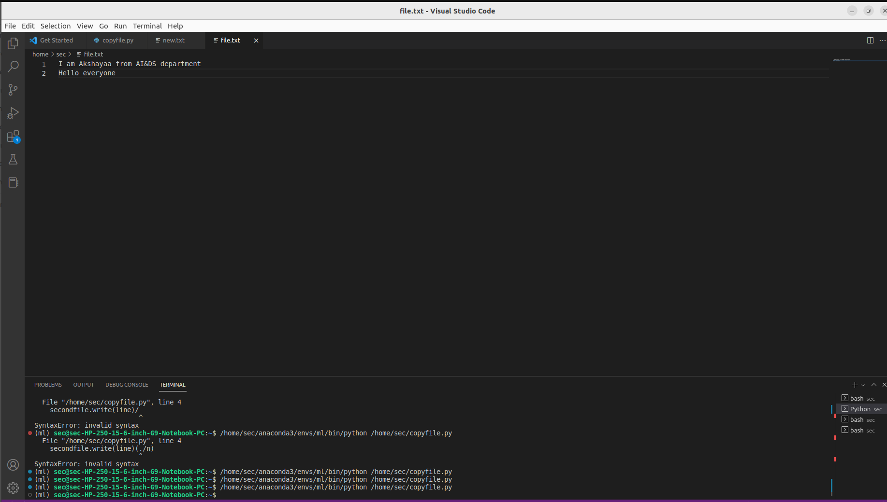

# copy-file
## AIM:
To write a python program for copying the contents from one file to another file.
## EQUIPEMENT'S REQUIRED: 
PC
Anaconda - Python 3.7
## ALGORITHM: 
### Step 1:
Open a text file as firstfile using with open command
### Step 2: 
Open another text file as secondfile using with open command
### Step 3: 
Using for loop , reading the content inside firstfile.
### Step 4:  
Copying first file in second file 
### Step 5: 
Run the Program. The First file will be copyed in second file
### Step 6: 
End the program.

## PROGRAM:
```
Program to copy the contents from one file to another file
Developed by: Akshayaa M
RegisterNumber: 22008405
with open('new.txt','r') as firstfile:
    with open('file.txt','a') as secondfile:
        for line in firstfile:
            secondfile.write(line)
```
## OUTPUT:

### Before coping:


### After coping:


## RESULT:
Thus the program is written to copy the contents from one file to another file.